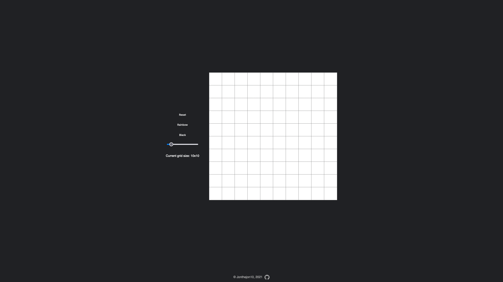

# Etch-a-Sketch app

## Made with Javascript, HTML and CSS.

Learning about creating grids based on input, event listeners as well as range sliders proved to be quite difficult, but I managed to push through and complete this project.

<a href="https://jonthejon10.github.io/Etch-a-Sketch/">Live preview</a>

